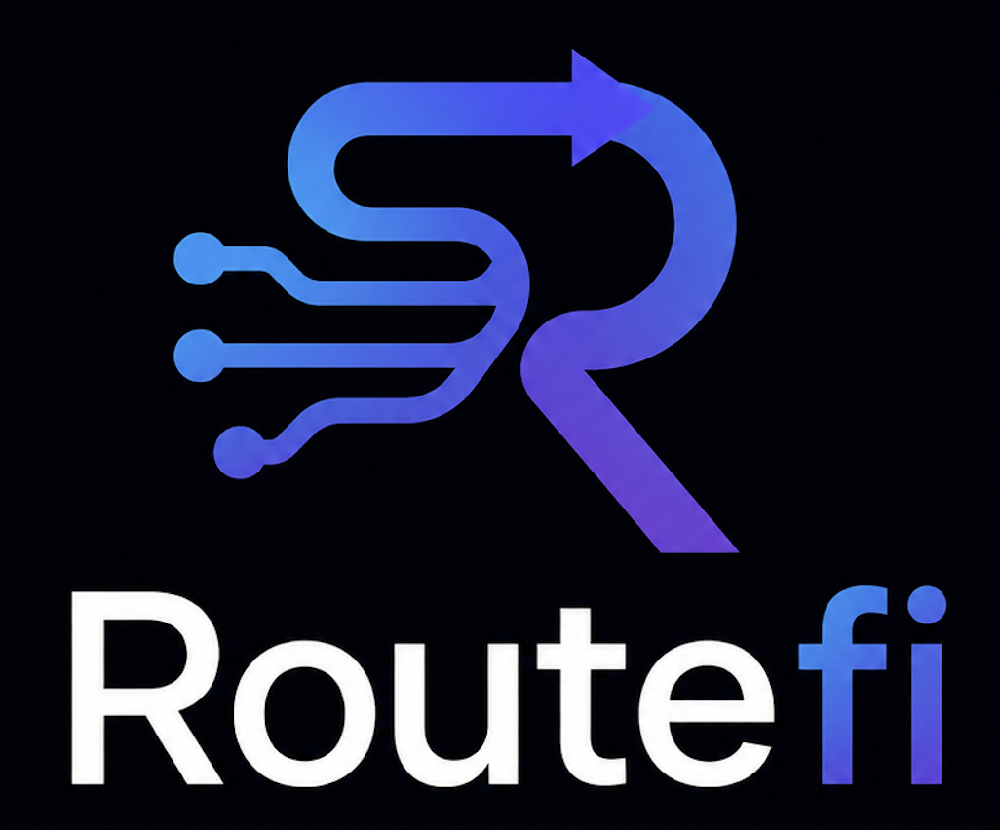

<p align="center">
  
</p>

<h1 align="center">Routefi</h1>

<p align="center">
  <strong>Pay-per-request API gateway for AI agents.</strong><br/>
  Agents pay USDC on Base via the x402 protocol — autonomously, cryptographically, on-chain.
</p>

<p align="center">
  <a href="#demo">Demo</a> ·
  <a href="#how-it-works">How It Works</a> ·
  <a href="#quick-start">Quick Start</a> ·
  <a href="#architecture">Architecture</a> ·
  <a href="#api-reference">API Reference</a>
</p>

---

## What is Routefi?

Routefi is a self-hosted API gateway that enforces **micropayments** before proxying requests to upstream APIs. It implements the [x402 payment protocol](https://x402.org) — when an agent calls a protected endpoint, the gateway:

1. Returns HTTP **402 Payment Required** with the price + wallet address
2. The agent signs a USDC transfer on Base (Sepolia testnet or mainnet)
3. The gateway verifies the payment via a facilitator, then **proxies the request**
4. A cryptographic **receipt** is issued — on-chain proof the agent paid

No subscriptions. No API keys to manage. Pay exactly what you use, per request.

---

## Demo

The interactive demo walks through the full agent payment lifecycle in 5 acts:

| Act | What happens |
|-----|-------------|
| 1 | **Provider Dashboard** — live admin UI showing routes, receipts, stats |
| 2 | **402 Without Payment** — raw `curl` hits the gateway, gets blocked |
| 3 | **Fund Agent Wallet** — CDP creates an EVM wallet on Base Sepolia |
| 4 | **Agent Pays & Gets Data** — one-click live terminal, agent pays autonomously |
| 5 | **Receipts & Proof** — on-chain receipt with tx hash, verifiable forever |

```
Dashboard: http://localhost:3000
Demo flow: http://localhost:3000/demo
```

---

## How It Works

```
AI Agent
  │
  ├─► GET /api/v1/posts
  │         │
  │    ┌────▼────────────────────────────┐
  │    │         Routefi Gateway          │
  │    │                                  │
  │    │  1. Match route → price $0.001   │
  │    │  2. No payment → 402 + payTo     │
  │    └──────────────────────────────────┘
  │
  ├─► Signs x402 USDC payment (Base Sepolia)
  │
  ├─► GET /api/v1/posts + X-Payment: <signed>
  │         │
  │    ┌────▼────────────────────────────┐
  │    │         Routefi Gateway          │
  │    │                                  │
  │    │  3. Verify payment w/ facilitator│
  │    │  4. Proxy → upstream API         │
  │    │  5. Issue X-Receipt header       │
  │    └──────────────────────────────────┘
  │
  └─► 200 OK + data + cryptographic receipt
```

### Key technologies

| Layer | Technology |
|-------|-----------|
| Payment protocol | [x402](https://x402.org) — HTTP-native micropayments |
| Payment network | [Base](https://base.org) L2 (Sepolia testnet / mainnet) |
| Agent wallets | [Coinbase CDP SDK](https://docs.cdp.coinbase.com/) |
| Facilitator | [x402.org/facilitator](https://x402.org/facilitator) (testnet) |
| Encryption (optional) | [SKALE BITE](https://docs.skale.space/) — threshold encrypted payment intents |
| Reputation (optional) | [ERC-8004](https://eips.ethereum.org/EIPS/eip-8004) on-chain agent scores |

---

## Quick Start

### Prerequisites

- Node.js 20+
- A Coinbase CDP account (for agent wallets) — [Get API keys](https://portal.cdp.coinbase.com/)
- Test USDC on Base Sepolia — [Circle faucet](https://faucet.circle.com/)

### 1. Clone and install

```bash
git clone https://github.com/avaneeshj70/routefi.git
cd routefi
npm install
```

### 2. Configure environment

```bash
cp .env.example .env
```

Edit `.env`:

```env
# Required
RT_PAY_TO_ADDRESS=0xYourWalletAddress
RT_ADMIN_KEY=your-secret-admin-key

# x402 (testnet defaults — works out of the box)
RT_BASE_NETWORK=base-sepolia
RT_FACILITATOR_URL=https://x402.org/facilitator

# CDP (for agent wallet creation in demo)
CDP_API_KEY_ID=your-cdp-key-id
CDP_API_KEY_SECRET=your-cdp-key-secret
CDP_WALLET_SECRET=your-cdp-wallet-secret
```

### 3. Configure routes

```bash
cp packages/gateway/routes.example.json routes.json
```

`routes.json` defines which upstream APIs are exposed and their prices:

```json
{
  "routes": [
    {
      "method": "GET",
      "path": "/api/v1/posts",
      "tool_id": "list-posts",
      "price_usdc": "0.001",
      "description": "List blog posts",
      "provider": {
        "provider_id": "jsonplaceholder",
        "backend_url": "https://jsonplaceholder.typicode.com"
      }
    }
  ]
}
```

### 4. Build and start

```bash
npm run build

# Start gateway (port 4402)
node --env-file=.env packages/gateway/dist/index.js

# Start dashboard (port 3000)
node dashboard/server.js
```

---

## Architecture

```
routefi/
├── packages/
│   ├── shared/          # Types, schemas, constants (composite TS project)
│   ├── gateway/         # Express HTTP gateway + middleware pipeline
│   └── sdk/             # Agent client SDK (RequestTapClient)
├── examples/
│   └── agent-demo/      # Demo agent: creates wallet, pays, fetches data
├── dashboard/           # Admin dashboard — Express + plain HTML/CSS/JS
│   └── public/
│       ├── landing.html # Marketing landing page
│       ├── demo.html    # 5-act interactive demo
│       └── dashboard.html # Live admin UI
└── contracts/           # SKALE BITE Solidity contracts
```

### Gateway middleware pipeline

```
Request
  → Rate limiter
  → Route matching
  → Idempotency check
  → IntentMandate verification (AP2)
  → x402 payment verification
  → Upstream proxy
  → Receipt generation
  → Response
```

---

## Agent SDK

Agents use the `@routefi/sdk` package to interact with the gateway:

```typescript
import { RequestTapClient } from "@routefi/sdk";

const client = new RequestTapClient({
  gatewayBaseUrl: "http://localhost:4402",
});

// Creates a CDP wallet on Base Sepolia
await client.init();
console.log("Agent wallet:", client.getWalletAddress());

// Automatically handles the 402 → pay → retry flow
const res = await client.request("GET", "/api/v1/posts");
console.log(res.data);               // upstream API response
console.log(res.receipt);            // cryptographic receipt
console.log(client.getTotalSpent()); // total USDC spent
```

The SDK handles the full x402 flow transparently:
- Detects 402 responses
- Signs the USDC payment using the CDP account
- Retries with `X-Payment` header
- Parses and stores the `X-Receipt` from the response

---

## Admin API

All admin endpoints require `Authorization: Bearer <RT_ADMIN_KEY>`.

| Endpoint | Description |
|----------|-------------|
| `GET /admin/health` | Uptime, route count, receipt count |
| `GET /admin/routes` | List all registered routes |
| `POST /admin/routes` | Add a route |
| `DELETE /admin/routes/:tool_id` | Remove a route |
| `GET /admin/receipts` | List receipts (filter by `outcome`, `tool_id`) |
| `GET /admin/receipts/stats` | Aggregate stats |
| `DELETE /admin/receipts` | Clear all receipts |

---

## Optional Features

### SKALE BITE — Encrypted Payment Intents

SKALE BITE (Blockchain Integrated Threshold Encryption) encrypts payment intents before consensus and decrypts after finality, preventing MEV and front-running.

```env
SKALE_RPC_URL=https://base-sepolia-testnet.skalenodes.com/v1/jubilant-horrible-ancha
SKALE_CHAIN_ID=324705682
SKALE_BITE_CONTRACT=0xYourBITEContract
SKALE_PRIVATE_KEY=0xYourKey
```

### ERC-8004 — Agent Reputation

Enforce minimum reputation scores for agents. Agents pass their token ID via `x-agent-id` header.

```env
ERC8004_RPC_URL=https://sepolia.base.org
ERC8004_CONTRACT=0x8004B663056A597Dffe9eCcC1965A193B7388713
ERC8004_MIN_SCORE=20
```

---

## Mainnet Deployment

```bash
cp .env.example .env.mainnet
# Set RT_BASE_NETWORK=base, RT_FACILITATOR_URL=https://api.cdp.coinbase.com/platform/v2/x402

node --env-file=.env.mainnet packages/gateway/dist/index.js
```

See [PRODUCTION.md](PRODUCTION.md) for full deployment guide (nginx, PM2, SSL).

---

## Running Tests

```bash
npm test                                    # all workspaces
npm test --workspace=packages/gateway       # gateway only
npm test --workspace=packages/sdk           # SDK only
```

---

## License

MIT

---

<p align="center">
  Built with ❤️ on <a href="https://x402.org">x402</a> · <a href="https://base.org">Base</a> · <a href="https://docs.cdp.coinbase.com/">Coinbase CDP</a>
</p>
